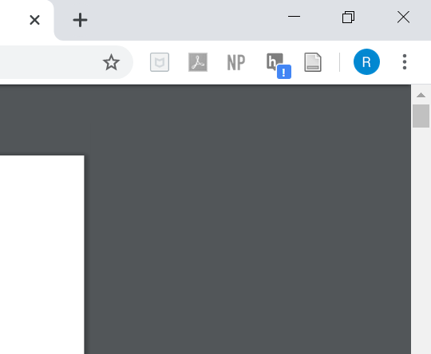
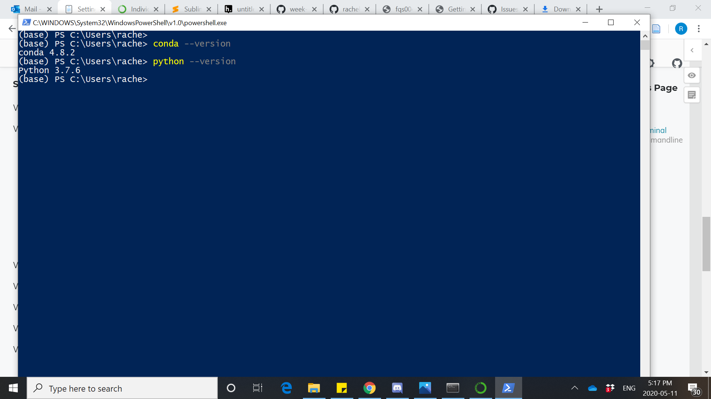

having trouble with hypothesis saying it is "inactive"

Goggled Solution: https://web.hypothes.is/help/how-to-activate-hypothesis-on-a-web-page/
- means that hypothesis does not have access to this page

Installation of Anaconda and Python successful!

