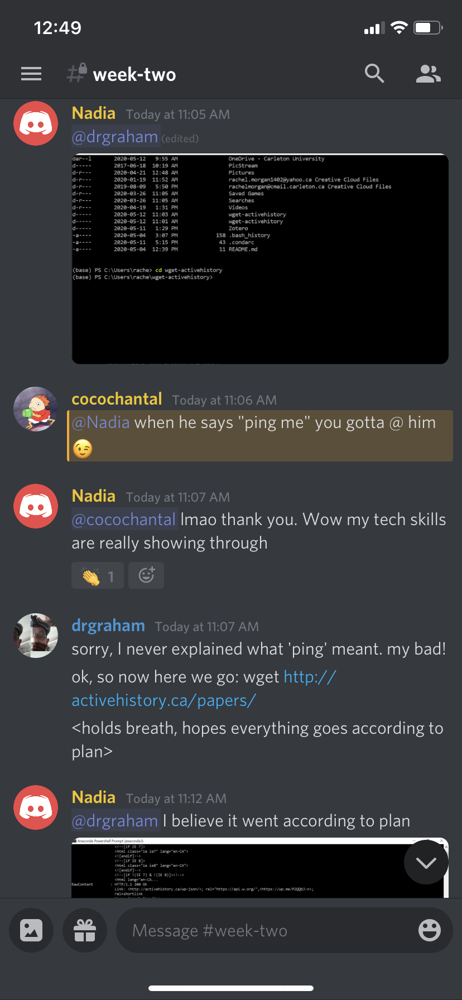

# Evidence Week 2

- having trouble with hypothesis saying it is "inactive"

Goggled Solution: https://web.hypothes.is/help/how-to-activate-hypothesis-on-a-web-page/
- means that hypothesis does not have access to this page

Installation of Anaconda and Python successful!

- this error message shows there was no subfolder in the file I was looking at

- when I try to open Wget it flashes on my screen but then disappears and will not open the application

- asked for help in the Discord

The part that got me stuck first was I hadn't put wget.exe into my c:\windows folder on my PC. Fortunately, when I asked for help in the Discord server, Dr. Graham worked with me step by step.

I then continued to try the next part on my own. I created the folder in sublime text and pasted the links to the images. However, when I returned to the command prompt something didn't look right.

- so I decided to leave it for now and try again later

I asked my brother, who is a physics and astronomy major at Waterloo and has taught himself a portion of coding, to help me.

- what got m stuck was that I had created a new path file for urls.txt but that wasn't the folder I had saved it in.

- once I got the Sublime text file saved in the same folder I had open in the powershell command prompt, the rest went smoothly.

Luckily, after all the help I received, I was able to figure out the first instructions for the API by myself.

I struggled with the first task in Rstudio. I went back to it multiple time but I knew it must be I didn't have something set up correctly because when I would try to load the packages I received the following warning

I had already had R downloaded on my computer for a statistics course I had previously taken. However, it was not the newest version of R so when I downloaded RStudio there was something missing. I uninstalled and reinstalled the newest version of R and then everyhting in RStudio went smoothly.
