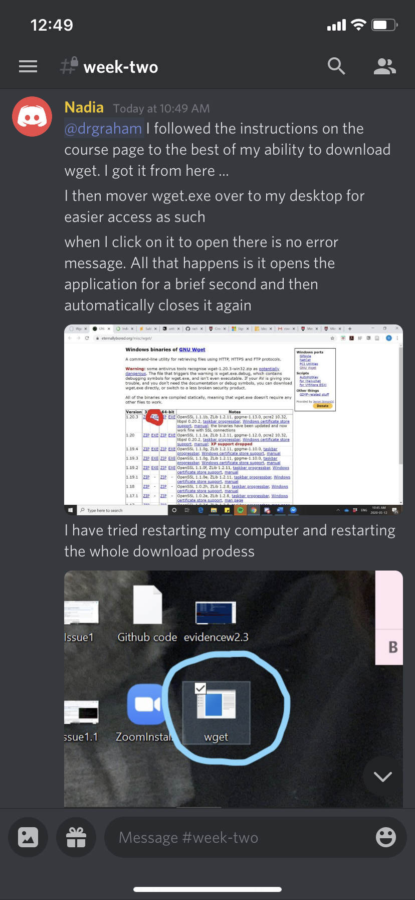
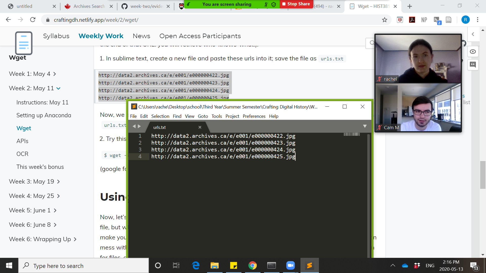
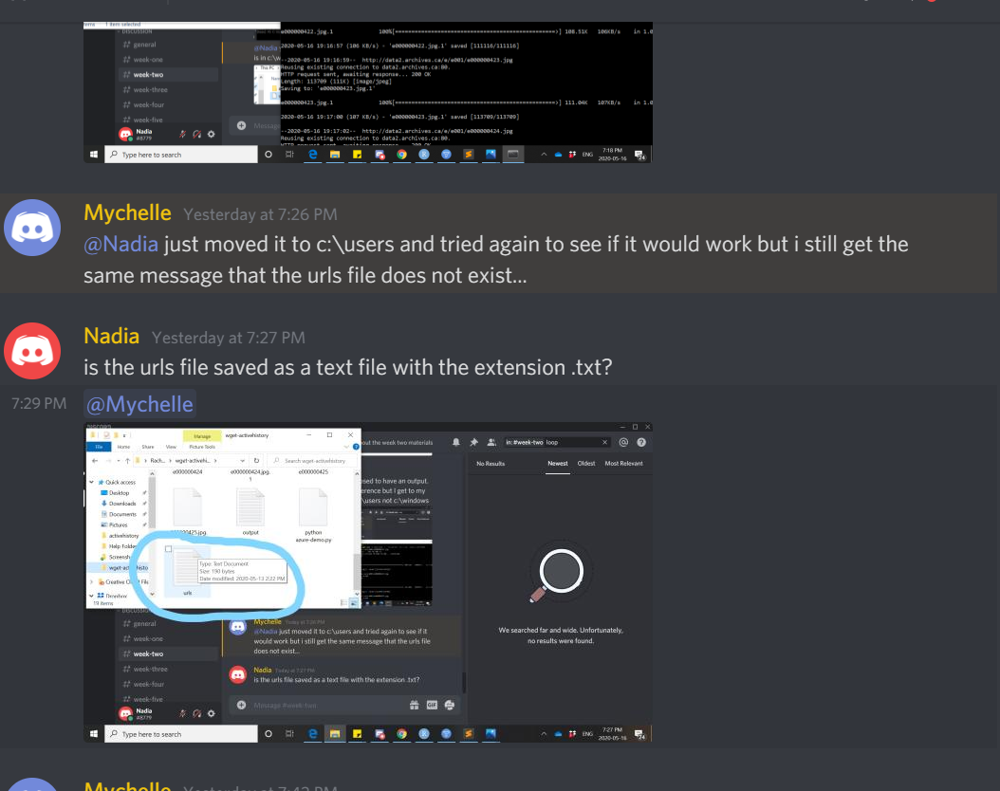

# Reflection for Week 2

Digital work in the humanities is unique in structure. In terms of funding, most money comes from grants. However, as stated in the article 
'Making such bargain: Transcribe Bentham and the quality and cost-effectiveness of crowdsourced transcription’, funding will not be given for something such as trancription alone. This is why digital history must involve effective collaboration. For Transcride Bentham, This meant the funding and support of the Transcription Desk and the collaborative work of the volunteers and editors.

This week, I got a much better grasp on the notion that digital history is a team effort. There were a few different ways in which I sought help this week and watch others work through their own work:

On the discord server

From my brother

 
And even providing some tips when I felt confident enough to do so.

When I struggled with the first assignment on handwritin, Dr. Graham said the reason for one of my error was because he forgot to put a line in the script. This is one of the benefits of having multiple sets of eyes looking at the same work, it is easier to catch mistakes.

Looking back at the Ayers et. al. piece from week one on women in digital history, an ethical issue is the due credit for such digital works. It seems very unlikely that each volunteer for Transcribe Bentham wil be credited in the final works of the Bentham Project, and they definitely won't recive any compensation. Is this really the democratization of history? It seems as if it may be taking more of a communist approach.

I have never really done an archive search at Carleton so I don't really know what is available. One time I used the archival maps on the first floor of MacDdrum library so I known those are available. Although I've never done much of an in-depth search, I feel Carleton does a pretty good job of making these resources available. One thing I know is that you can sign into your Carleton domain and have access from off-campus. This is very useful.

