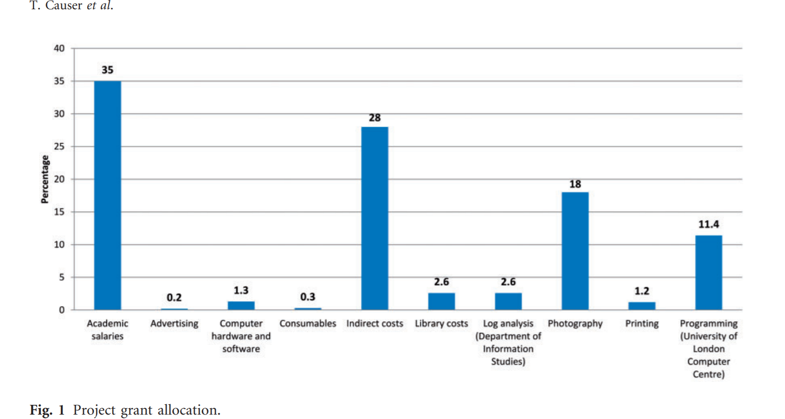

# Week 2 Notes

text mining: Process of analysing text to extract information from it (MALLET)

- voluneering and crowdsourcing of transcriptors

- options t save an go back, check for vadalism, spam, etc.

- bias in former which sometimes deletes deleted text and additions

- in the future, solely using XML files and XSLT transformation makes the process more economical

- must analyze what your funding is for

- editorial expertise costs money but is important

- volunteering does not include compensation

- who gets the credit for the work?

- does this make the history more democratic?

        - becomes more of a "people's history" rather than from the perspective of the historian
        - does this eliminate bias?
- 
